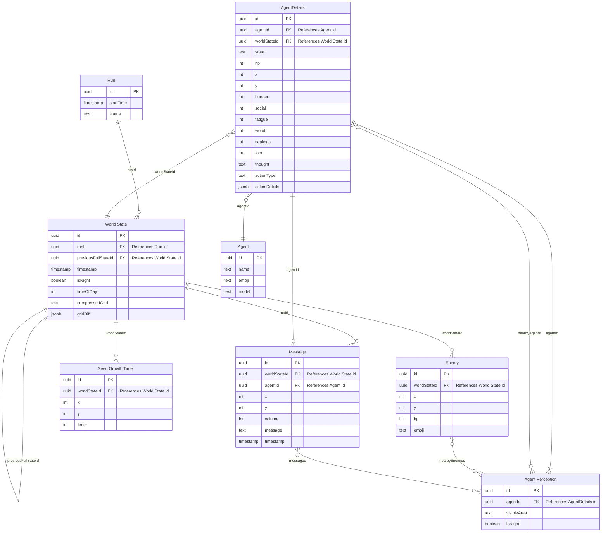

```mermaid
erDiagram
    Run {
        uuid id PK
        timestamp startTime
        text status
    }

    "World State" {
        uuid id PK
        uuid runId FK "References Run id"
        uuid previousFullStateId FK "References World State id"
        timestamp timestamp
        boolean isNight
        int timeOfDay
        text compressedGrid
        jsonb gridDiff
    }

    Run ||--o{ "World State": runId
    "World State" ||--|| "World State": previousFullStateId

    Agent {
        uuid id PK
        text name
        text emoji
        text model
    }

    AgentDetails {
        uuid id PK
        uuid agentId FK "References Agent id"
        uuid worldStateId FK "References World State id"
        text state
        int hp
        int x
        int y
        int hunger
        int social
        int fatigue
        int wood
        int saplings
        int food
        text thought
        text actionType
        jsonb actionDetails
    }

    AgentDetails }o--|| "World State": worldStateId
    AgentDetails }o--|| Agent: agentId
    
    "Agent Perception" {
        uuid id PK
        uuid agentId FK "References AgentDetails id"
        text visibleArea
        boolean isNight
    }

    AgentDetails ||--|{ "Agent Perception": agentId
    AgentDetails }o--o{ "Agent Perception": nearbyAgents
    Enemy }o--o{ "Agent Perception": nearbyEnemies
    Message }o--o{ "Agent Perception": messages

    Enemy {
        uuid id PK
        uuid worldStateId FK "References World State id"
        int x
        int y
        int hp
        text emoji
    }

    "World State" ||--o{ Enemy: worldStateId

    "Seed Growth Timer" {
        uuid id PK
        uuid worldStateId FK "References World State id"
        int x
        int y
        int timer
    }

    "World State" ||--o{ "Seed Growth Timer": worldStateId

    Message {
        uuid id PK
        uuid worldStateId FK "References World State id"
        uuid agentId FK "References Agent id"
        int x
        int y
        int volume
        text message
        timestamp timestamp
    }

    "World State" ||--o{ Message: runId
    AgentDetails ||--o| Message: agentId
```

